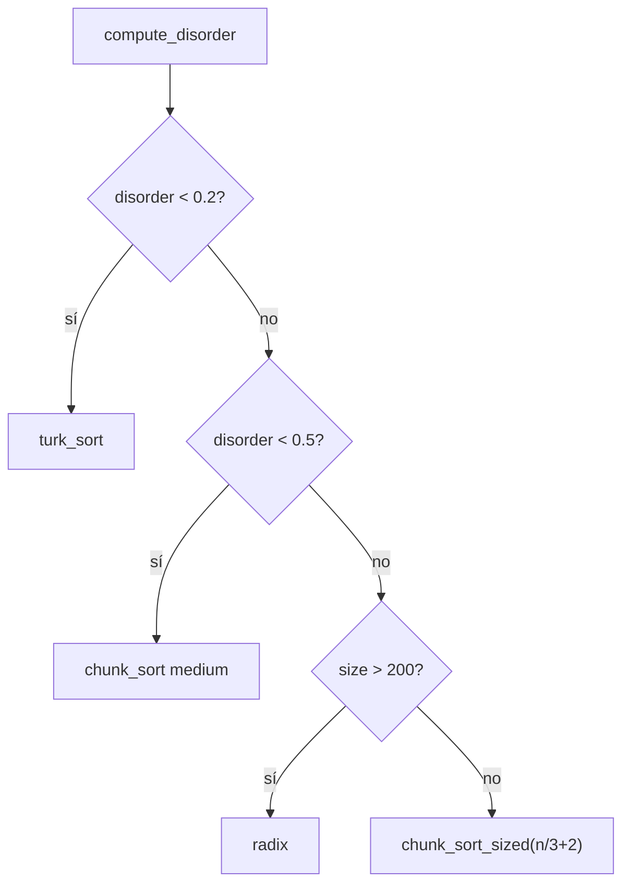

# Modo adaptivo y medida de desorden

**Archivos:** `adaptive.c`, `disorder.c`  
**Flag implícito:** sin flag (comportamiento por defecto) o `--adaptive`  
**Complejidad:** híbrida — elige entre O(n²), O(n√n) y O(n log n)

---

## `compute_disorder` — métrica de desorden

```c
double compute_disorder(t_stack *stack);
```

### Definición

Proporción de **pares invertidos** respecto al total de pares ordenables:

```
disorder = mistakes / total_pairs

mistakes    = #{ (i,j) | i antes que j en la pila ∧ value[i] > value[j] }
total_pairs = n × (n-1) / 2
```

### Implementación (`disorder.c`)

Doble bucle sobre nodos de A:

```c
current = stack->top;
while (current) {
    compare = current->next;
    while (compare) {
        total_pairs++;
        if (current->value > compare->value)
            mistakes++;
        compare = compare->next;
    }
    current = current->next;
}
return mistakes / total_pairs;
```

### Valores de referencia

| Entrada | disorder aprox. |
|---------|-----------------|
| Ya ordenada | 0.0 |
| Un swap adyacente | muy bajo (~0.02 con n=10) |
| Aleatoria uniforme | ~0.5 |
| Completamente invertida | 1.0 |

El tester `ft_ps_tester` genera secuencias con desorden objetivo:

| Tipo | Rango % |
|------|---------|
| simple | 15 – 19.9 % |
| medium | 20 – 49.9 % |
| complex | 50 – 55 % |

Internamente divide entre 100: `0.15` … `0.55`.

---

## `adaptive_sort` — selección automática

```c
void adaptive_sort(t_stack *stack_a, t_stack *stack_b);
```



### Umbrales y justificación

| Condición | Algoritmo | Razón |
|-----------|-----------|-------|
| `disorder < 0.2` | `turk_sort` | Pocas inversiones: O(n²) con buena constante gana |
| `0.2 ≤ disorder < 0.5` | `chunk_sort` | Desorden moderado: chunks + coste mínimo |
| `disorder ≥ 0.5` y `n > 200` | `radix` | Alto desorden en pilas grandes: O(n log n) |
| `disorder ≥ 0.5` y `n ≤ 200` | `chunk_sort_sized(n/3+2)` | Radix caro en n pequeño |

---

## Relación con `run_method`

| Invocación | Comportamiento |
|------------|----------------|
| Sin flags | `adaptive_sort` |
| `--adaptive` | `adaptive_sort` (explícito) |
| `disorder == 0` en `run_method` | return antes de llamar adaptive |

`run_method` comprueba desorden == 0 **antes** de elegir algoritmo; `adaptive_sort` lo recalcula internamente.

---

## Modo `--bench`

Cuando se usa `--bench`, `setup_benchmark()` escribe en stderr:

- `disorder` calculado con la misma fórmula.
- Estrategia prevista según flags y umbrales (p. ej. `"Adaptive / chunk_sort"`).

La salida de operaciones en stdout sigue siendo la del algoritmo realmente ejecutado.

---

## Coherencia con el tester

El test **[8/10] Default strategy** exige que ejecutar sin flag produzca **las mismas operaciones** que `--adaptive` en casos como `5 4 3 2 1`.

El test **[7/10] Mode specialization** exige que cada flag gane en su rango de desorden. Los umbrales de `adaptive_sort` están alineados con esos rangos, pero el modo adaptivo elige solo por desorden/tamaño, no por flag.

---

## Complejidad computacional de `compute_disorder`

- Tiempo: O(n²) en número de nodos.
- Solo se ejecuta una vez por llamada a `adaptive_sort` (o al inicio de `run_method` si no hay bench).
- Con n = 500 son 124 750 comparaciones de pares — negligible frente al coste de ordenar.