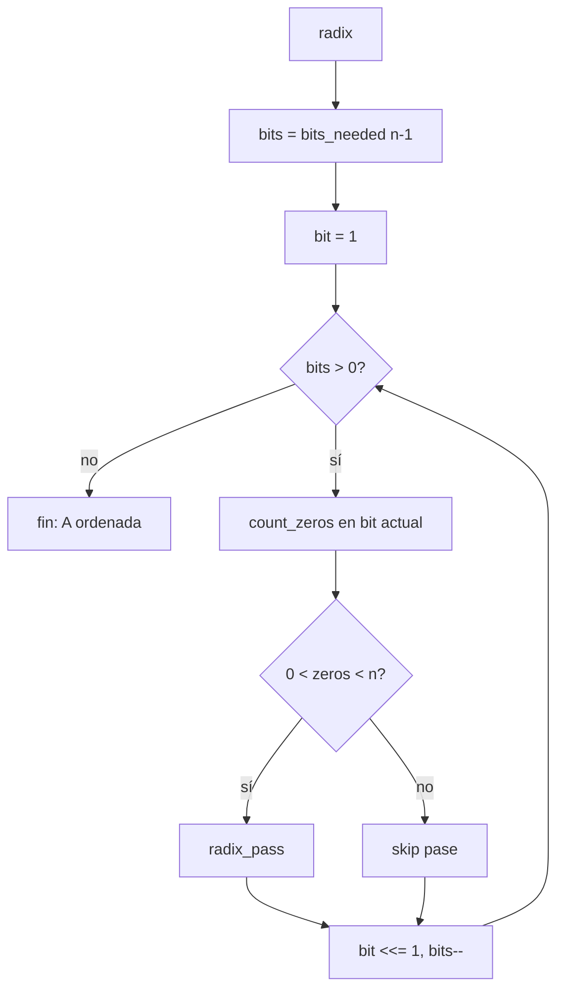

# Radix Sort (algoritmo complejo)

**Archivo:** `radix.c`  
**Flag:** `--complex` (solo si `n > 200`)  
**Complejidad teórica:** O(n log n) en número de operaciones de pila  
**Tipo:** LSD Radix Sort sobre **índices normalizados** (bits del índice, no del valor)

---

## Por qué índices y no valores

Los valores originales pueden ser enormes (`INT_MIN` … `INT_MAX`). Tras `stack_index()`, cada elemento tiene un índice en `[0, n−1]`, lo que limita los bits a `⌊log₂(n−1)⌋ + 1`.

Ejemplo: n = 500 → índice máximo 499 → **9 bits**.

---

## Estructura del algoritmo



---

## Funciones internas

### `bits_needed(max_index)`

Cuenta cuántos desplazamientos a la derecha hasta que `max_index` sea 0.

```c
// max_index = 499 → 9 bits
while (max_index > 0) { max_index >>= 1; bits++; }
```

Usa `size - 1` (no `size`) para no hacer un pase extra cuando n es potencia de 2.

### `count_zeros(stack, bit)`

Recorre la pila y cuenta nodos donde `(index & bit) == 0`. Sirve para **saltar pases inútiles**:

| Caso | Efecto si no se salta |
|------|------------------------|
| `zeros == n` | n `pb` + n `pa` = 2n ops desperdiciadas |
| `zeros == 0` | n `ra` sin separar nada |

### `radix_pass(a, b, bit)`

Un pase LSD estable sobre el bit actual:

```
repite n veces (n = tamaño actual de A):
    si (top.index & bit) == 0  →  pb
    si no                      →  ra
empty_b: devuelve todo de B a A con pa
```

**Estabilidad:** los elementos con bit 0 salen primero a B y vuelven encima de A; los de bit 1 quedan debajo, conservando orden relativo.

### `empty_b`

```c
while (b->size > 0) pa(a, b);
```

Tras cada pase, B debe quedar vacía para el siguiente.

---

## Ejemplo conceptual (4 elementos, 2 bits)

Índices tras normalizar: supongamos orden inicial de índices en A = `[3, 0, 2, 1]`

**Bit 1 (LSB):**

| index | bin | acción |
|-------|-----|--------|
| 3 | 11 | ra |
| 0 | 00 | pb |
| … | … | … |

Tras pase + `empty_b`, los de LSB=0 quedan encima, orden relativo preservado.

**Bit 2:** repite el proceso. Tras todos los bits, A queda ordenada por índice ascendente.

---

## Optimización de skip

```c
zeros = count_zeros(stack_a, bit);
if (zeros > 0 && zeros < stack_a->size)
    radix_pass(...);
```

Solo ejecuta el pase si hay mezcla de 0s y 1s en ese bit.

---

## Coste operacional real

El número de operaciones es **casi independiente del desorden** de la entrada: depende de `n` y del número de bits.

| n | bits | ops típicas (aprox.) |
|---|------|----------------------|
| 100 | 7 | ~1084 (fijo en práctica) |
| 500 | 9 | ~6500–6800 |

Por eso en este proyecto **no se usa radix con n ≤ 200**: chunk ancho es más barato en pilas pequeñas.

---

## Cuándo se activa

```c
// set_algorithm.c
if (has_flag(argc, argv, "--complex") && stack_a->size > 200)
    radix(stack_a, stack_b);

// adaptive.c
else if (disorder >= 0.5 && stack_a->size > 200)
    radix(stack_a, stack_b);
```

---

## Operaciones que NO se usan

Durante un pase de radix, B solo recibe `pb` y luego `pa`. No hay rotaciones simultáneas útiles (`rr`/`rrr`), así que el ahorro viene exclusivamente de **omitir pases triviales**.