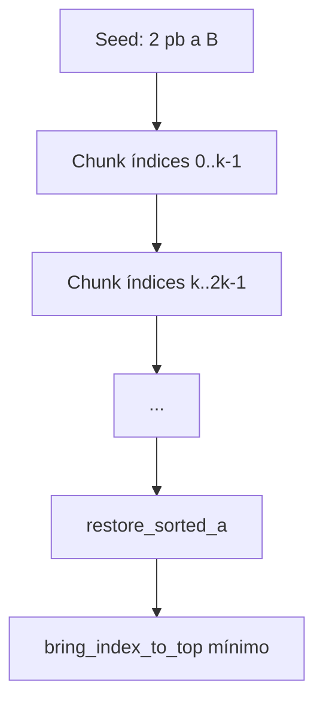

# Chunk Sort (algoritmo medio)

**Archivos:** `chunk_sort.c`, `chunk_sort_utils.c`  
**Flag:** `--medium`  
**Complejidad teórica:** O(n√n)  
**Idea:** dividir por rangos de índice, empujar por bloques a B y reconstruir A ordenada

---

## Variantes

| Función | Uso | Tamaño de chunk |
|---------|-----|-----------------|
| `chunk_sort` | `--medium` | `n/5 + 2` |
| `chunk_sort_sized` | `--complex` (n ≤ 200), adaptive | parámetro explícito |
| Flag `--complex`, n ≤ 200 | sustituto de radix | `n/3 + 2` |

---

## Visión general



---

## `chunk_sort_sized` — núcleo

```c
void chunk_sort_sized(t_stack *a, t_stack *b, int chunk_size);
```

### 1. Seed inicial

```c
if (a->size >= 2) { pb(a,b); pb(a,b); }
total = a->size + b->size;
```

Igual que turk: dos elementos en B antes de procesar chunks. `total` conserva el n original para los rangos de índice (0 … n−1).

### 2. Bucle por chunks

```c
start = 0;
end   = chunk_size - 1;
while (a->size > 0) {
    if (end >= total) end = total - 1;
    push_chunk_cheapest(a, b, start, end);
    start = end + 1;
    end   = start + chunk_size - 1;
}
```

Cada iteración vacía de A todos los nodos cuyo **índice** cae en `[start, end]`.

### 3. Restauración — `restore_sorted_a`

```c
while (b->size > 0) {
    rotate_pos_to_top(b, stack_max_pos(b));
    pa(a, b);
}
bring_index_to_top(a, 0);
```

Misma estrategia que la fase 2 de turk: siempre sacar el máximo de B.

---

## `push_chunk_cheapest`

```c
while (stack_has_index_in_range(a, start, end)) {
    best = find_cheapest_in_range(a, b, start, end);
    rotate_both_to_top(a, b, best.pos_a, best.pos_b);
    pb(a, b);
}
```

A diferencia del chunk sort clásico (rotar al primer elemento del rango encontrado desde el tope), aquí se reutiliza la **lógica de coste mínimo de turk**, pero **solo entre nodos del chunk actual**.

Esto permite usar `rr`/`rrr` y reduce operaciones frente a la versión anterior del proyecto.

---

## Utilidades (`chunk_sort_utils.c`)

### `find_cheapest_in_range(a, b, start, end)`

Igual que `find_cheapest`, pero ignora nodos cuyo `index` no está en `[start, end]`.

### `stack_has_index_in_range(stack, start, end)`

Recorrido O(n): devuelve 1 si existe al menos un nodo con índice en el rango.

### `ft_sqrt(n)`

Entero `r` tal que `(r+1)² > n`. Disponible para fórmulas alternativas de chunk; la implementación actual de `--medium` usa `n/5 + 2`.

### `rotate_up` / `reverse_rotate_down`

Envoltorios que llaman `ra`/`rb` o `rra`/`rrb` según `stack->name`.

### `rotate_pos_to_top(stack, pos)`

Lleva la posición `pos` al tope eligiendo el camino corto (mitad superior → `rotate_up`, inferior → `reverse_rotate_down`).

---

## Elección del tamaño de chunk

| Modo | Fórmula | Efecto con n=100 |
|------|---------|------------------|
| `--medium` | `n/5 + 2` = 22 | ~5 chunks, equilibrio coste/bloque |
| `--complex` (n≤200) | `n/3 + 2` = 35 | chunks más anchos, menos fases |
| adaptive (alto desorden, n≤200) | `n/3 + 2` | igual que complex pequeño |

Chunks **más pequeños** → más fases, mejor en desorden medio.  
Chunks **más grandes** → menos fases, mejor cuando el desorden es alto y n es pequeño.

---

## Comparación con Turk Sort

| Aspecto | Turk | Chunk |
|---------|------|-------|
| Selección de elemento | cualquiera en A | solo del rango actual |
| Orden de inserción en B | coste global mínimo | coste mínimo en rango |
| Fases | una | varias (por chunk) |
| Mejor en | desorden bajo | desorden 20–50 % |

---

## Cuándo se activa

- Flag `--medium`
- `adaptive_sort` si `0.2 ≤ disorder < 0.5`
- Sustituto de radix en `--complex` y adaptive cuando `n ≤ 200`