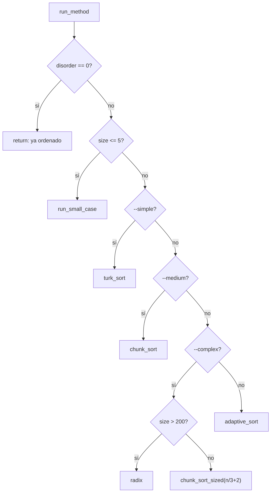

# Selección de algoritmo (`run_method`)

**Archivos:** `set_algorithm.c`  
**Cabecera:** `includes/algorithms.h`  
**Complejidad declarada:** depende del modo elegido

Este módulo es el **orquestador**: decide qué estrategia ejecutar según el tamaño de la pila, los flags de línea de comandos y el desorden de la entrada.

---

## Punto de entrada

`run_method()` se invoca desde `main.c` después del parsing y la asignación de índices (`stack_index`).

```c
void run_method(t_stack *stack_a, t_stack *stack_b, int argc, char **argv);
```

---

## Flujo de decisión



---

## `run_small_case`

Casos base con **soluciones hardcodeadas** para 2–5 elementos. No usan índices de forma compleja salvo `bring_index_to_top` y `sort_three_with_offset`.

| Tamaño | Función      | Archivo        |
|--------|--------------|----------------|
| 2      | `alg_two`    | `short/short.c` |
| 3      | `alg_three`  | `short/short.c` |
| 4      | `alg_four`   | `short/short.c` |
| 5      | `alg_five`   | `short/short.c` |

---

## Flags de línea de comandos

| Flag        | Algoritmo                         | Complejidad teórica |
|-------------|-----------------------------------|---------------------|
| `--simple`  | `turk_sort`                       | O(n²)               |
| `--medium`  | `chunk_sort`                      | O(n√n)              |
| `--complex` | `radix` si n > 200, si no chunk ancho | O(n log n)   |
| *(ninguno)* | `adaptive_sort`                  | híbrido             |

### Detalle de `--complex`

Radix es óptimo en pilas grandes, pero con **n ≤ 200** el coste fijo por pase lo hace peor que chunk. Por eso:

```c
if (stack_a->size > 200)
    radix(stack_a, stack_b);
else
    chunk_sort_sized(stack_a, stack_b, stack_a->size / 3 + 2);
```

El chunk ancho (`n/3 + 2`) actúa como sustituto de baja complejidad amortizada en entradas pequeñas con alto desorden.

---

## Entrada ya ordenada

Si `compute_disorder(stack_a) == 0`, la función retorna sin imprimir operaciones. Esto cumple la regla del tester: **0 movimientos** para entradas ordenadas.

El desorden se lee de `stack_a->bench->disorder` si existe modo `--bench`; si no, se calcula en el momento.

---

## Relación con el benchmark

`setup_benchmark()` (en `bench_utils.c`) usa la misma lógica de umbrales de desorden que `adaptive_sort` para etiquetar la estrategia en stderr cuando se pasa `--bench`.