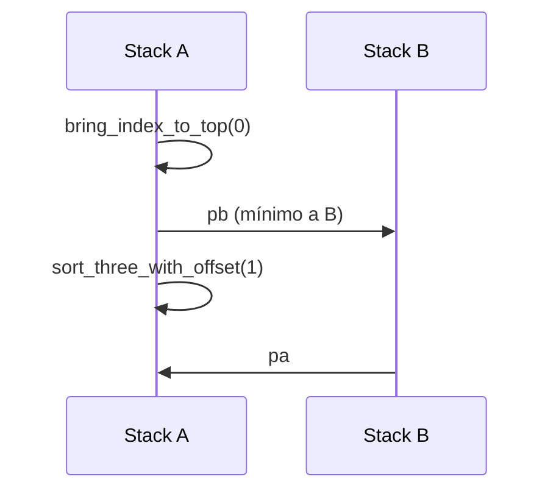

# Algoritmos cortos (2–5 elementos)

**Archivos:** `short.c`, `short_utils.c`  
**Activación:** `run_small_case()` cuando `stack_a->size <= 5`  
**Complejidad:** O(1) — número fijo de operaciones acotado

---

## Concepto previo: índices normalizados

Antes de ordenar, `stack_index()` asigna a cada nodo un **índice relativo** de 0 (mínimo) a n−1 (máximo), comparando `value` entre nodos. Los algoritmos cortos operan sobre **índices**, no sobre valores brutos.

---

## `alg_two` — dos elementos

```c
void alg_two(t_stack *stack);
```

| Condición | Acción |
|-----------|--------|
| `top->index > top->next->index` | `sa` |
| ya ordenado | ninguna operación |

Solo compara los dos índices en el tope. Máximo **1 operación**.

---

## `alg_three` — tres elementos

Delega en `sort_three_with_offset(a, 0)`.

### `sort_three_with_offset`

Recibe un **offset** para reutilizar la misma tabla de casos cuando los índices no empiezan en 0 (p. ej. tras sacar el mínimo a B).

```c
first  = top->index       - offset
second = top->next->index - offset
third  = bot->index       - offset
```

Se comparan las 6 permutaciones posibles de `{0,1,2}`:

| Patrón (f,s,t) | Secuencia de ops |
|----------------|------------------|
| (0,2,1)        | `sa`, `ra`       |
| (1,0,2)        | `sa`             |
| (1,2,0)        | `rra`            |
| (2,0,1)        | `ra`             |
| (2,1,0)        | `sa`, `rra`      |
| (0,1,2)        | ya ordenado      |

Máximo **2 operaciones** (criterio del tester: ≤ 3 GOOD, ≤ 5 PASS).

---

## `bring_index_to_top`

```c
void bring_index_to_top(t_stack *a, int target);
```

1. `pos = stack_find_index(a, target)` — posición del nodo con ese índice.
2. Si `pos <= size/2` → `ra` × pos.
3. Si no → `rra` × (size − pos).

Siempre elige el camino más corto al tope (mitad superior o inferior de la pila).

---

## `alg_four` — cuatro elementos



1. Saca el **índice 0** (mínimo global) a B.
2. Ordena los 3 restantes con offset 1 (índices locales 0,1,2).
3. Devuelve el mínimo con `pa`.

Resultado: A ordenada ascendente con el mínimo en el tope.

---

## `alg_five` — cinco elementos

Misma idea extendida:

1. `bring_index_to_top(0)` → `pb`
2. `bring_index_to_top(1)` → `pb`
3. `sort_three_with_offset(a, b->size)` — offset = 2 (dos elementos ya en B)
4. `pa`, `pa`

Los dos menores quedan temporalmente en B; los tres centrales se ordenan en A; luego se reintegran.

---

## Límites del tester

Para n = 3 y n = 5 el tester comprueba **todas las permutaciones**:

| n | GOOD (máx ops) | PASS (máx ops) |
|---|----------------|----------------|
| 3 | 3              | 5              |
| 5 | 12             | 15             |

Estos algoritmos están diseñados para cumplir esos límites de forma determinista.